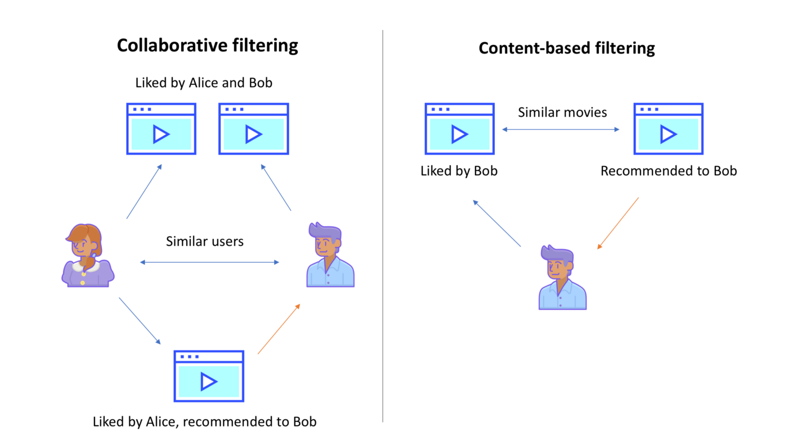

# Movie Recommender System
### Background
As a DJ, the art of deciding what to play next has always fascinated me. Curating and recommending content is a huge part of modern media consumption. As I explored datasets for this capstone project I realized a movie database is essentially a vast record collection. Recommender systems are integral in the digital age from streaming services to E-commerce. Knowing an audience and making a fruitful recommendation is an art-form ripe for exploration. 

### The Data
The [dataset](https://www.kaggle.com/rounakbanik/the-movies-dataset) from Kaggle consisted of 45,000 movies. Those movies included expected information like title and genre. Extensive information such as the entire cast and crew was also available. Numeric metrics included information like budget and revenue. I cleaned and wrangled the data in preparation for building my model. This step is contained in the Notebooks folder, it is titled [Data Wrangling](https://github.com/LiftedAquatic/Movie-Recommender-System/blob/main/Notebooks/Data%20Wrangling.ipynb).
### Exploratory Data Analysis
Being that my overall project required an *unsupervised learning* approach with text-centric categorical data my EDA step was a bit minimal. I did a bit of exploratory analysis of some of the numerical data. This step is contained in the Notebooks folder, it is titled [Exploratory Data Analysis](https://github.com/LiftedAquatic/Movie-Recommender-System/blob/main/Notebooks/Exploratory%20Data%20Analysis.ipynb).
### Pre-processing
I focused on three main approaches for this project: **Clustering**, **Cosine Similarity**, and **Collaborative Filtering**. I compared various algorithms to test efficacy. For Clustering, I tested K Means, and DBSCAN. Cosine Similarity is already known to be highly effective. For Collaborative Filtering I tested *Singular Value Decomposition*, *K Nearest Neighbors* and *Non-Negative Matrix Factorization*. Through Cross-Validation and Silhouette Coefficient analysis I chose K Means and Singular Value Decomposition. This step is contained in the Notebooks folder, it is titled [Preprocessing](https://github.com/LiftedAquatic/Movie-Recommender-System/blob/main/Notebooks/Preprocessing.ipynb).

### Modeling
Before running my algorithms, I tuned the hyper-parameters through a process called **Grid Search Cross-Validation**. I then wrote functions to invoke the algorithms and generate a list of films. For Clustering, each film got assigned to a numbered group. So when I recommend based on Film A, all the other films in that cluster are in the recommended list. For Collaborative Filtering, the function takes in a User ID and a movie title. The algorithm then finds similar users and makes a prediction of how said user will rate the given film. For Cosine Similarity, the model creates a big matrix of similarity scores between movies. When a movie is entered into the function, it produces a list of the top 10 most similar movies. The final model is **hybrid system** that combines Cosine Similarity with Collaborative Filtering created a top 10 most similar list ranked by how much a user is predicted to like them. This step is contained in the Notebooks folder, it is titled [Modeling](https://github.com/LiftedAquatic/Movie-Recommender-System/blob/main/Notebooks/Modeling.ipynb).

Special *thank you* to my mentor **Jeremy Cunningham** 

Check out the [White Paper](https://github.com/LiftedAquatic/Movie-Recommender-System/blob/main/White%20Paper.pdf)
